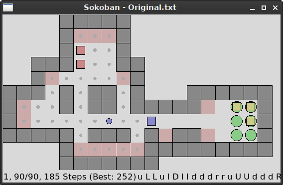

Sokoban
=======

_2015-2021, Tobias Küster_

Just my version of the classic Sokoban puzzle. Initially, this was just one among
many little entries in my `games` repository, but I like this one quite a bit (in
fact more than other, more professional versions of the game I've played so far)
and thus decided to move this to its own repo and give it a bit more polish.

It has a super-minimalistic UI, but it can read arbitrary Sokoban level files and
keep a record of what level has been solved in how many moves. Also, it features
some amount of "planning", not only for finding the path to a certain location, 
but also for planning the "push-path" for moving a single crate to a new location.
This does not make the puzzles any easier, but it makes the game much less tedious
to play and more fun. Also features basic undo and snapshot-taking. Levels are not
included, but plenty can be found on the internet.

Features:
* load Sokoban levels in standard Sokoban level file format
* save progress (solved/unsolved, number of turns) for each level in JSON file
* controls with arrow-keys or with mouse
* save/restore snapshot of current level, undo/redo-stack
* path-planning for movement and push-planning for pushing single boxes

Game Start and Loading Level Files
----------------------------------

Initially, there will be no known level sets, but many can be found on the internet,
often in a `.txt` format that can be read by this program, e.g. like this (from microban):

	####
	# .#
	#  ###
	#*@  #
	#  $ #
	#  ###
	####
	; 1

To add the level set, run the program as `python3 sokoban_game.py -f path/to/levelset.txt`.
The levels will then be copied to the configuration directory `~/.config/t-kuester/sokoban`
and can then be played without specifying the path to the file.

Now when started, the game will present a simple command-line menu of all known level
sets and the respective number of solved levels and total number of levels in the set.
Select the level set you want to play to start the game.

	Known Level Sets
	 1   2/ 90   Original.txt
	 2   0/155   microban.txt
	Select level set: 1

Your progress on the different level sets will be saved in the file `sokoban_saves.json`
in the configuration directory.

Game Window
-----------

UI Symbols:
* blue dot: player
* green circle: target for box
* yellow box: a regular box
  * blue box: box selected for push-planning
  * red box: a box that is not on a target and can not be moved any more
* dark-grey block: walls/obstacles
* light-red block: deadend (boxes can't reach a target from here)

Status Line Format:
* current Level
* solved / total number of levels in current level set
* number of steps used so far
* best number of steps used for this level
* last 30 moves (u/l/d/r; upper-case means pushed)

Controls
--------

Keyboard-Controls:
* Arrow Keys: Move/Push
* Shift + Arrow Keys: Move until next obstacle
* PgUp / PgDn: Next/Previous Level
* Shift + PgUp / PgDn: Next/Previous unsolved Level (if any)
* R: reload level
* S / L: save or load single snapshot (lost when switching the level)
* D: show dead-ends
* . (period): show positions reachable without pushing
* Z / Y: undo/redo last moves
* Q: quit

Mouse-Controls:
* Click on ground: Move player to that position, if possible (right-click: skip animation)
* Click on box: select box for push-planning
* Click on ground with selected box: Move box to that position, if possible (right-click: skip animation)
* Mouse Wheel up/down: undo/redo last moves

Planning
--------

Besides simple movement, the game has three (somewhat) advanced search- and
planning related features: Path-Planning, Push-Planning, and Dead-end-Detection.

* **Path-Planning** is not really special, and most, if not all, Sokoban games
  have this. It calculates the shortest route from one point to another without 
  pushing any boxes and sends the player character that way.
* **Push-Planning** is an extension of Path-Planning where instead of moving the
  player, a box is to be moved from its current location to the destination.
  This involves re-positioning the player to push the box from different sides,
  and may even require to push the box multiple times over the same spot to be
  able to position the player on the right side for the next push.
* **Dead-end-Detection** is used to determine all locations in a level from where
  a box can not be pushed to any goal position. This includes literal dead-ends,
  but also all regions close to a wall where a box can not be pushed away from
  that wall any more. Useful for pruning planning branches and for actual play.

Solver
------

The above search and planning functions have been combined to a simple solver.
It is not very fast or powerful, but can be used to solve many small levels with
few (4-5) boxes. Obviously, the state space is enormously big, since each box
in each position is technically a different state, and then the position of the
player itself. This solver uses some (not very clever) tricks to reduce that.

First, boxes are not identified, i.e. the state only holds a set of positions
occupied by boxes, but not which box is in which position. Also, the position
of the player _can_ be (mostly) ignored, determining only in which region of
the level the player currently is (e.g. which side of a box blocking a narrow
passage). That last one is optional, since it can miss the best solution.

Solving a level is triggered with the Space key and once done the plan will be
executed and the solved score will be counted as if the level was properly
solved. Once started, the process will take a few seconds (depending on the
number of boxes) and can be interrupted rather unceremoniously by hitting ctrl+c
in the terminal, but not in the UI itself.
